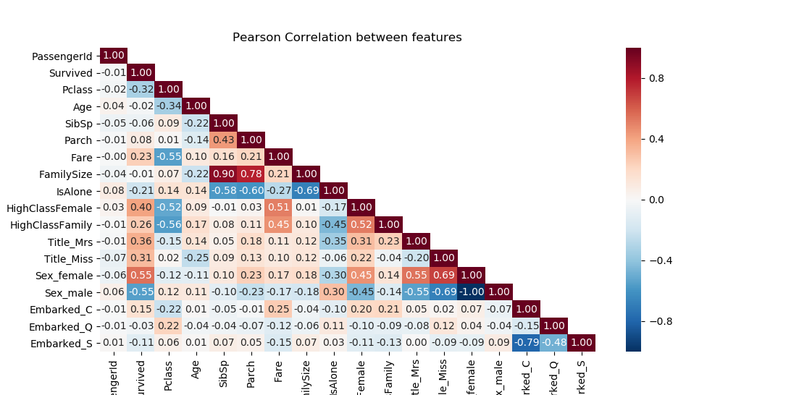

# Titanic (Kaggle)
Did you survive on Titanic? What characteristic can increase your chance of survival on titanic?</br>

This is my first Kaggle project, so please be gentle on my code and approach. The main objective of this project is to estimate which passenger is most likely to survival on Titanic. This repository contains the analysis and ML model developed to achieve this objective.

## Getting Started

### Requirements
The analysis tool and ML models used for this project are pre-install with anaconda. 
The only library that might be missing is seaborn.<br>

Seaborn could be installed through pip:
```
pip install seaborn
```

## Usage
#### Models available
The ML models used in this project are:
* **Random Forest**
* **Extra Tree**
* **Gradient Boosting**
 
### Train and Test
Follow the steps below to train and test the model:
1. Put the *test.csv* file to *dataset/* folder
2. Open the **train.py** 
3. Define the model at line 40 (Default model is Gradient Boosting)
4. Set the optim_param to **'Random'** or **'Grid'** to tune the model's hyperparameter (skip this step if want to use the default hyperparameter)
5. Run the train.py

A *submission.csv* will be generated/override at *dataset/* folder which can be submitted to Kaggle to check the classification accuracy.

## Approach overview
The features that were used to train the model are shown below.


Details on the analysis, feature engineering and rationality of features used will be included in the future.

## Result
The following table illustrates the classification accuracy of each model. The validation set is a random subset from the *train.csv*.
The test score was obtained through Kaggle's submission.
Both RandomForest and ExtraTree show clear signs of overfitting to the training set while GradientBoosting is underfitting. <br>  

| Models | Train | Valid | Test |
| :----: |:------------:| :-----------:| :----------:|
| RandomForest     | 99.860 | 81.461 | 79.904 |
| ExtraTree        | 98.601 | 81.818 | 74.162 |
| GradientBoosting | 90.070 | 86.364 | 80.382 |

Overfitting on RandomForest and ExtraTrees happen quite often due to the overcomplicated trees in the model. 
Underfitting, on the other hand, is a bit tricky, there are methods which could be taken to overcome this, such as feature engineering, hyperparameter tuning, etc.
